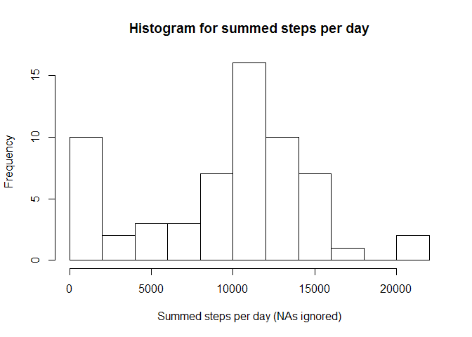

# Reproducible Research: Peer Assessment 1
OS: Windows 8.1

R version: x64 3.1.2

R-studio version: 0.98

Required packages: core packages, lubridate

## Loading and preprocessing the data

The code below reads data into R. It assumes that the relevant data file is presented in your working directory and is called "activity.zip".


```r
require(lubridate)
```

```
## Loading required package: lubridate
```

```r
data <- read.csv("activity.csv",colClasses=c("integer","character","integer"))
data <- transform(data, date = ymd(date))
```

## What is mean total number of steps taken per day?

The code below produces a histogram for the total number of steps taken per day and calculates a mean and a median for it. NAs are ignored at this step.


```r
steps_per_day <- split(data$steps, data$date)
sum_steps_per_day <- sapply(steps_per_day, function(x) {sum(x, na.rm = TRUE)})
hist(sum_steps_per_day, breaks = 9, main = "Histogram for summed steps per day", xlab = "Summed steps per day (NAs ignored)")
```

 

```r
daily_mean <- mean(sum_steps_per_day)
daily_median <- median(sum_steps_per_day)
```

The mean is **9354.2295082**.

The median is **10395**.

## What is the average daily activity pattern?

The code below produces a time-series plot of the average nunbers of steps taken in a certain time interval across various days. NAs are again ignored.


```r
steps_per_interval <- split(data$steps, data$interval)
mean_steps_per_interval <- sapply(steps_per_interval, function(x) {mean(x, na.rm = TRUE)})
intervals <- as.integer(names(mean_steps_per_interval))
plot(x = intervals, y = mean_steps_per_interval, type = "l", main = "Average daily activity", xlab = "Time in minutes", ylab = "Average number of steps")
```

 

```r
named_max_steps <- mean_steps_per_interval[mean_steps_per_interval == max(mean_steps_per_interval)]
max_steps_interval <- as.integer(names(named_max_steps))
```

The five minutes interval **835** contains the biggest avarage number of steps.

## Imputing missing values

The code below computes the number of NAs, fills in missing values in the data and then produces computations similar to those in the "What is mean total number of steps taken per day?" section to compare means and medians. The strategy for filling in missing values is to use the means for each interval calculated above rounded to an integer.


```r
NAs <- sum(is.na(data$steps))
```

The number of NAs is **2304**. We can fill them.


```r
fillNAs <- function(data, steps) {
      interval_names <- as.integer(names(steps))
      for (i in 1:nrow(data)) {
            if (is.na(data$steps[i])) {
                  data$steps[i] = as.integer(steps[interval_names == data$interval[i]])
            }
      }
      data
}
data_noNAs <- fillNAs(data, mean_steps_per_interval)
```

Now that the NAs are filled the comparissons can be made.


```r
steps_per_day_noNAs <- split(data_noNAs$steps, data_noNAs$date)
sum_steps_per_day_noNAs <- sapply(steps_per_day_noNAs, function(x) {sum(x, na.rm = TRUE)})
hist(sum_steps_per_day_noNAs, breaks = 9, main = "Histogram for summed steps per day", xlab = "Summed steps per day (NAs ignored)")
```

 

```r
daily_mean_noNAs <- mean(sum_steps_per_day_noNAs)
daily_median_noNAs <- median(sum_steps_per_day_noNAs)
mean_change <- daily_mean_noNAs - daily_mean
median_change <- daily_median_noNAs - daily_median
```

The new mean is **1.074977\times 10^{4}**. The mean has faced a change of **1395.5409836**.

The new mean is **10641**. The mean has faced a change of **246**.

## Are there differences in activity patterns between weekdays and weekends?

The code below plots the patterns of activity on weekdays and weekends separately so a reader can compare them. For that it splits the dataset with filled NAs by a new factor variable levels of which correspond to weekends and weekdays respectively.


```r
week_day <- wday(data_noNAs$date)
num_observ <- nrow(data_noNAs)
datetype <- character(num_observ)
for (i in 1:num_observ) {
      if (week_day[i] == 1 | week_day[i] == 7) {
            datetype[i] <- "weekend"
      } else {
            datetype[i] <- "weekday"
      }
}
datetype <- as.factor(datetype)
data_wdatetype <- cbind(data_noNAs,datetype)
data_weekday <- subset(data_wdatetype, datetype == "weekday")
data_weekend <- subset(data_wdatetype, datetype == "weekend")
```

Now that the dataset is split by the new variable, the plots can be produced.


```r
par(mfrow=c(2,1))
steps_per_interval <- split(data_weekday$steps, data_weekday$interval)
mean_steps_per_interval <- sapply(steps_per_interval, function(x) {mean(x, na.rm = TRUE)})
intervals <- as.integer(names(mean_steps_per_interval))
plot(x = intervals, y = mean_steps_per_interval, type = "l", main = "Average daily activity for weekdays", xlab = "Time in minutes", ylab = "Average number of steps")
steps_per_interval <- split(data_weekend$steps, data_weekend$interval)
mean_steps_per_interval <- sapply(steps_per_interval, function(x) {mean(x, na.rm = TRUE)})
intervals <- as.integer(names(mean_steps_per_interval))
plot(x = intervals, y = mean_steps_per_interval, type = "l", main = "Average daily activity for weekends", xlab = "Time in minutes", ylab = "Average number of steps")
```

 
